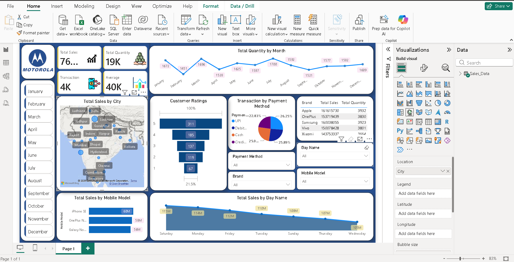

# Motorola Mobile Sales Dashboard

## Project Overview

This project presents an interactive Power BI dashboard for analyzing mobile sales performance.

The dashboard provides insights into sales, quantity sold, customer ratings, payment methods, brands, mobile models, cities, and monthly trends.

## Dashboard Features

- Total Sales
- Total Quantity Sold
- Total Transactions
- Average Sales
- Monthly Quantity Trend
- Sales by City
- Customer Ratings Analysis
- Transaction by Payment Method
- Sales by Brand
- Sales by Mobile Model
- Sales by Day Name

## Tools & Technologies

- Power BI
- Power Query
- DAX
- Microsoft Excel

## Dataset

The dataset contains mobile sales transaction information including:

- Date
- Brand
- Units Sold
- Price Per Unit
- Customer Age
- City
- Payment Method
- Customer Rating
- Mobile Model

## Dashboard Preview

## Key Insights

- Analyzed monthly sales and quantity trends.
- Compared sales performance across different cities.
- Identified sales patterns across mobile brands and models.
- Analyzed customer rating distribution.
- Compared different payment methods.
- Examined sales performance across days of the week.

## Project Files

- `Motorola_Mobile_Sales_Dashboard.pbix` — Power BI dashboard file
- `Mobile_Sales_Data.xlsx` — Cleaned dataset
- `dashboard.png` — Dashboard preview
